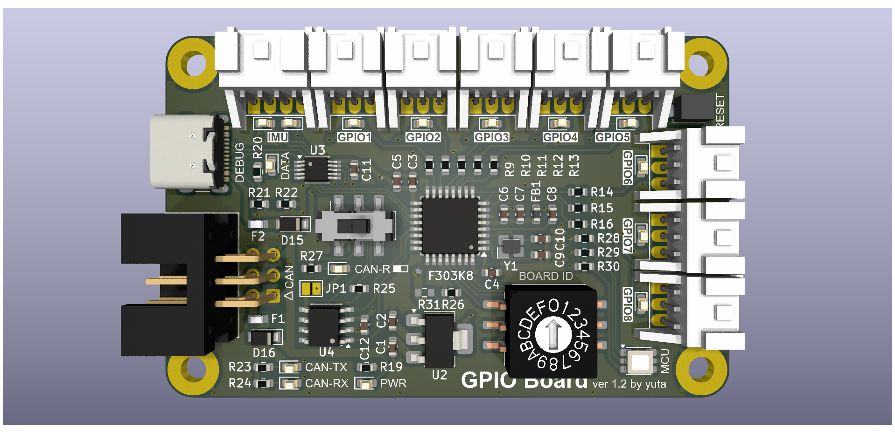
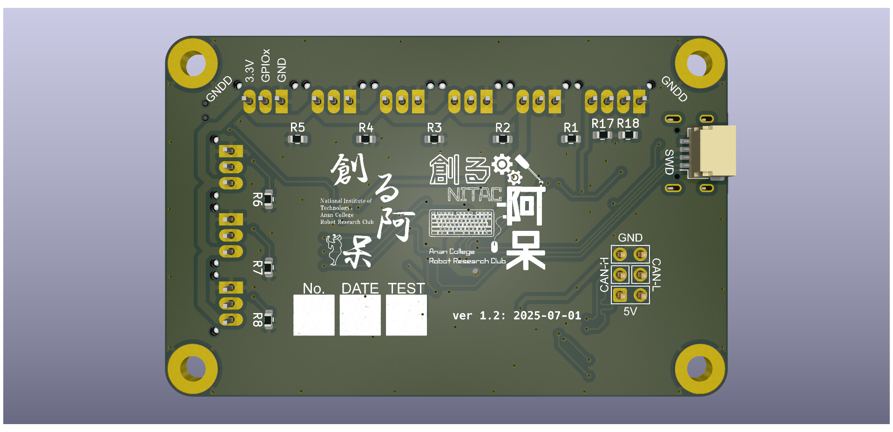

# GPIO Board

リミットスイッチや IMU を接続したり、GPIO を利用したりするための基板

## 変更履歴

### ver1.0 (発注日：2025/03/10)
- 初回完成

### ver1.1 (発注日：2025/04/12)
- 三端子レギュレーターの型番を変更
- ショットキーバリアダイオードの型番を変更
- 各LEDの型番を変更
- 電源確認用LEDの場所を変更
- RGBLEDを追加
- 終端抵抗接続用スイッチの型番を変更
- 終端抵抗接続確認用のLEDを追加
- シルクを微調整
- 水晶発振子のフットプリントを修正

### ver1.2 (発注日：2025/07/01)
- USB-Cコネクタの位置を微調整
- 基板下部の取付穴を通常の穴に変更