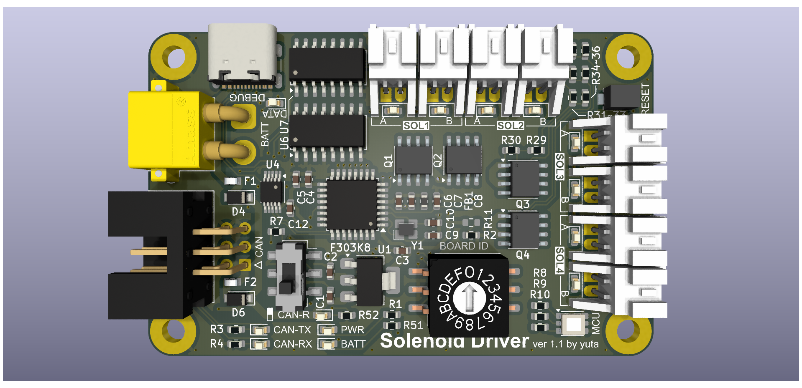
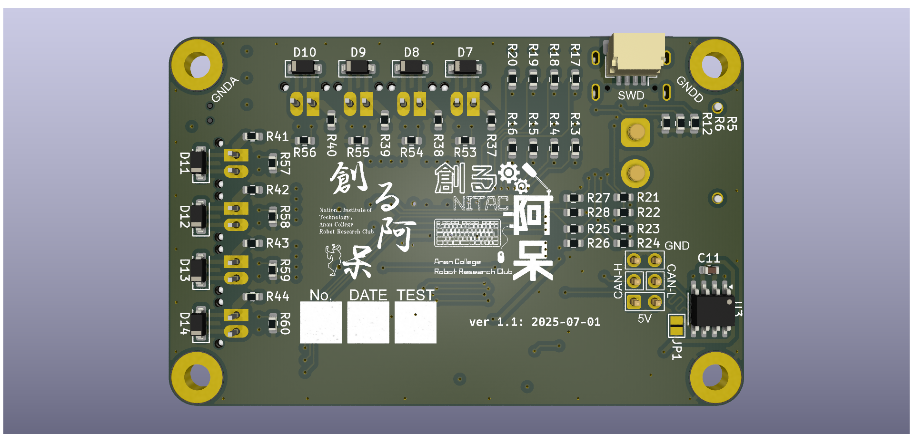

# Solenoid Driver

ソレノイドやソレノイドバルブを制御するための基板

## 変更履歴

### ver1.0 (発注日：2025/04/12)
- 初回完成

### ver1.1 (発注日：2025/07/01)
- 電源コネクタの接続が逆になっていたのを修正
- ソレノイド接続部に電流制限抵抗を追加
- 基板下部の取付穴を通常の穴に変更
- コネクタ部のシルクのサイズを微調整